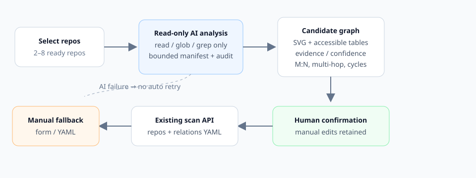

# Cross-repository topology discovery

跨仓关联扫描前的拓扑预分析让用户先选择仓库，由只读 AI Agent 提出**候选服务图**，再由人工确认并转换成既有 `MultiRepoConfig`。本阶段不创建 scan/session，不启动白盒子扫描或 correlation workflow，也不产生漏洞结论。

## User flow

1. 在新建扫描页切换到 **跨仓关联**，默认使用 **自动拓扑**。
2. 选择同一 workspace 中至少 2 个 ready 仓库。
3. 点击 **自动关联分析**，轮询 queued/running/completed 状态。
4. 在 SVG 图或关系/服务表中复核证据：
   - 拖动节点、从连接柄新增边；
   - 修改 from/to/protocol、启用/禁用/删除边；
   - 切换 `entrypoint/backend` 能力；
   - 选择每仓现扫或复用来源；
   - 撤销/重做或重置布局；
   - 对孤立仓库显式标记为参考仓库。
5. 点击 **确认拓扑**。确认后任何语义编辑都会重新变为未确认，并禁用启动按钮；布局拖拽/重置不改变语义。
6. 点击 **启动跨仓扫描**，提交确认后的 YAML，后续完全复用现有跨仓编排。

AI 失败、超时、取消、重启中断或结构化输出 malformed 时，不会自动重跑。用户可显式重新分析，或切换 **手工模式** 使用原表单/YAML。

## Runtime limits

| Environment variable | Default | Meaning |
| --- | ---: | --- |
| `SUPERNOVA_TOPOLOGY_MAX_REPOS` | `8` | Maximum selected repositories per analysis. |
| `SUPERNOVA_TOPOLOGY_MAX_CONCURRENT` | `1` | Maximum concurrently active analyses in this web process. |
| `SUPERNOVA_TOPOLOGY_TIMEOUT_SECONDS` | `900` | Provider wall-clock timeout. |
| `SUPERNOVA_TOPOLOGY_MAX_TURNS` | `30` | Provider turn ceiling. |
| `SUPERNOVA_TOPOLOGY_CACHE_TTL_SECONDS` | `86400` | Completed-result reuse TTL. |
| `SUPERNOVA_TOPOLOGY_MAX_STORED_ANALYSES` | `100` | Per-workspace retained terminal analysis records. |

Navigation manifests are additionally bounded by `NavigationManifestLimits`: 1,200 text files/repository, 256 KiB/file, 64 KiB prompt payload, 120 clues/repository, and 240 chars/clue. These are navigation facts only; they do not contain source/sink or vulnerability hints.

## Cache and persistence

- State is atomically written under `workspaces/<ws>/correlation-topology/analyses/<analysis_id>/state.json`.
- The same directory retains the manifest/fingerprint detail, normalized result, raw output, usage/cost, and `tool-audit.ndjson`.
- Fingerprint inputs are protocol version, sorted repository names, Git HEAD, bounded dirty status, or a bounded metadata fingerprint for non-git repositories.
- Without `refresh: true`, a recent completed result with the same fingerprint is reused and no new provider tokens are spent.
- Web restart marks queued/running jobs as `interrupted`; they are never auto-resubmitted.
- Cleanup removes only excess terminal records and never removes active jobs.

Direct web-process analysis uses workspace provider credentials and the process-global pricing configuration. Workspace-specific pricing override injection is not applied to this pre-analysis call; scan-time pricing remains unchanged.

## Evidence, confidence, and protocols

- Supported executable protocols are exactly `grpc`, `http`, and `graphql`.
- Edge identity is the ordered triple `(from, to, protocol)`; duplicate identities merge while M:N, fan-out, multi-hop, backend-to-backend, and cycles remain distinct.
- Unknown protocols and unverifiable references remain in `uncertain` and cannot enter confirmed relations.
- Evidence must stay inside the selected repository, refer to an existing file, and have a valid line/snippet. Invalid evidence is retained but marked invalid and downgraded.
- A high-confidence executable edge requires valid client-side evidence. Handler evidence strengthens backend capability but is not a substitute for the caller evidence rule.
- Empty node/edge suggestions are valid outcomes. The backend does not invent a default entrypoint or star graph.

## Read-only policy and audit

Both engines receive `tool_policy=readonly-code`:

- openai-agents exposes only `read_file`, `glob`, and `grep`;
- Claude/Codex built-ins are restricted to `Read`, `Glob`, and `Grep`, with strict MCP configuration and no collector/progress/subagent tools.

Every provider tool event is appended to the analysis-local NDJSON audit log. The analysis working directory is analysis-scoped rather than the workspace root.

## Rollout and rollback

1. Deploy core + web + frontend together; old `role` YAML remains valid.
2. Enable the normal web route. The automatic mode is default, but users can switch to manual form/YAML at any time.
3. Observe `SUPERNOVA_TOPOLOGY_*` limits and analysis usage/cost.
4. Rollback by hiding/avoiding the automatic mode and using **手工模式**; existing saved configs and scan orchestration do not require migration. `roles` is additive and can remain in saved YAML.

## Troubleshooting

- **422 invalid repositories**: check that at least two selected names exist and are ready in the same workspace.
- **429 too many analyses**: wait for an active job or raise the concurrency limit deliberately.
- **failed/provider_failed**: inspect `state.json` error and usage; retry explicitly or use manual mode.
- **failed/timeout**: raise the wall-clock or turn limit only after estimating repository size; do not blindly auto-retry.
- **interrupted**: this is expected after a web restart; click retry only when desired.
- **empty graph**: inspect `coverage` and `uncertain`; manually add topology or retry with more repositories.
- **unknown protocol**: keep it as a clue, then manually map it to grpc/http/graphql only when justified.
