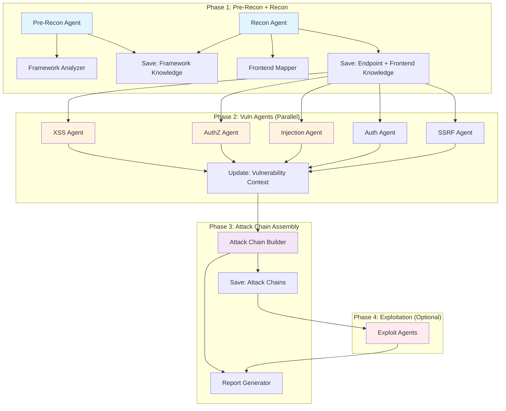

# Shannon 漏报修复方案设计规范

**文档版本**: 1.0
**创建日期**: 2025-01-05
**状态**: 设计阶段

## 目录

1. [背景与目标](#1-背景与目标)
2. [问题分析](#2-问题分析)
3. [整体架构](#3-整体架构)
4. [阶段 1: Prompt 优化](#4-阶段-1-prompt-优化)
5. [阶段 2: 服务层基础设施](#5-阶段-2-服务层基础设施)
6. [阶段 3: 协调层与跨 Agent 通信](#6-阶段-3-协调层与跨-agent-通信)
7. [数据结构定义](#7-数据结构定义)
8. [实施计划](#8-实施计划)

---

## 1. 背景与目标

### 1.1 背景

Shannon 是一个 AI 驱动的渗透测试工具，通过多 Agent 协作自动化漏洞评估。在针对 Juice Shop 等应用的测试中，发现了以下漏报问题：

1. **越权漏洞漏报**：框架自动生成的端点（如 finale-rest）未被充分识别
2. **XSS 多步骤攻击链断裂**：前端路由 → API → 渲染的完整攻击路径未连接
3. **前后端脱节**：后端 API 分析未考虑前端渲染上下文

### 1.2 目标

1. 提高框架自动生成端点的识别率
2. 构建完整的前后端攻击链视图
3. 建立 Agent 间知识共享机制
4. 保持各 Agent 的职责边界清晰

---

## 2. 问题分析

### 2.1 根本原因

| 问题类别 | 根本原因 | 影响范围 |
|---------|---------|---------|
| 框架端点识别不足 | 静态代码分析难以捕获运行时生成的端点 | 越权、XSS、Injection |
| 多步骤攻击链断裂 | Agent 间缺乏知识传递，攻击路径不完整 | XSS、复杂攻击 |
| 前后端脱节 | 后端分析未考虑前端渲染上下文 | XSS |
| 职责边界模糊 | Recon 既做描述又做判断，与 Vuln Agent 重复 | 架构清晰度 |

### 2.2 漏报案例

**案例 1: DELETE /api/Feedbacks/:id 越权**
- 框架：finale-rest 自动生成
- 问题：Recon 报告中未明确列出 DELETE 方法
- 结果：越权 Agent 未分析该端点

**案例 2: Video XSS 多步骤攻击链**
- 路径：`/videos` (用户输入) → POST /api/Videos (存储) → `/videoManager` (渲染)
- 问题：XSS Agent 未追踪前端渲染上下文
- 结果：完整攻击链断裂

---

## 3. 整体架构

### 3.1 职责边界

```
┌─────────────────────────────────────────────────────────────────┐
│                         职责边界定义                              │
├─────────────────────────────────────────────────────────────────┤
│                                                                 │
│  Recon Agent（描述性分析）                                      │
│  ├─ 这个端点有什么样的保护？                                    │
│  ├─ 哪些 HTTP 方法存在？                                        │
│  ├─ 需要什么认证级别？                                          │
│  ├─ 有所有权验证吗？                                            │
│  └─ 是框架自动生成的吗？                                        │
│                              ↓                                  │
│  Vuln Agents（漏洞分析）                                        │
│  ├─ 这些保护是否充分？                                          │
│  ├─ 如果没有所有权验证 → IDOR 风险？                           │
│  ├─ 如果只有 isAuthenticated → 垂直越权风险？                 │
│  └─ 能否绕过这些保护？                                          │
│                                                                 │
└─────────────────────────────────────────────────────────────────┘
```

### 3.2 三阶段修复方案

```
阶段 1: Prompt 层（立即可部署）
├─ Recon 报告修复：明确列出所有 HTTP 方法
├─ 越权 Agent 增强：HTTP 方法明确检查
└─ 共享工具：框架端点识别指引

阶段 2: 服务层（中期）
├─ 框架分析插件：自动识别 finale-rest/epilogue
└─ 前端路由映射：追踪前端到后端的完整路径

阶段 3: 协调层（长期）
├─ 知识共享机制：Agent 间结构化数据传递
└─ 攻击链重组：自动组装多步骤攻击场景
```

---

## 4. 阶段 1: Prompt 优化

### 4.1 共享工具文件

**文件**: `apps/worker/prompts/shared/_endpoint-security-context.txt`

Recon Agent 使用此模板收集端点安全上下文。核心原则：**描述性分析，不判断充分性**。

```markdown
<endpoint_security_context>

## Endpoint Security Context Analysis

Your mission is to build a comprehensive security context for each discovered endpoint. This is **descriptive analysis** - you document what protections exist, NOT whether they are sufficient.

### Information to Collect for Each Endpoint

For every endpoint, collect and document:

1. **HTTP Methods (Complete List)**
   - Do NOT use "ALL" shorthand
   - List each method explicitly: GET, POST, PUT, PATCH, DELETE
   - Note if a method is explicitly blocked (e.g., with denyAll())
   
2. **Authentication Requirements**
   - anon = No authentication required
   - user = Valid JWT required (any role)
   - customer/deluxe/accounting/admin = Specific role required
   - denyAll = Explicitly blocked

3. **Middleware Chain**
   - List all middleware in execution order
   - Note the purpose of each middleware
   - Examples: isAuthorized(), appendUserId(), denyAll()

4. **Framework Origin**
   - manual = Explicitly defined in routes/
   - finale-rest = Auto-generated by finale-rest framework
   - epilogue = Auto-generated by epilogue framework
   - other = Specify the framework

5. **Parameter Analysis**
   - List all parameters (path, query, body, header)
   - Note parameter sources (user-controlled vs server-generated)
   - Identify any parameter transformation/validation

6. **Ownership Validation**
   - Check if code validates resource ownership
   - Look for patterns like: resource.UserId === user.id
   - Note if validation exists: "yes (file:line)" or "none detected"

### Framework-Specific Patterns

#### finale-rest / epilogue

When analyzing applications using finale-rest or epilogue:

1. **Identify framework usage:**
   - Search for: `finale.initialize()`, `epilogue.initialize()`
   - Look for: `finale.resource()`, `epilogue.resource()`
   - Check model configurations

2. **Auto-generated endpoints:**
   For each model configured with the framework, assume these endpoints exist:
   - `GET /api/{Model}s` → findAll
   - `GET /api/{Model}s/:id` → findOne
   - `POST /api/{Model}s` → create
   - `PUT /api/{Model}s/:id` → update
   - `DELETE /api/{Model}s/:id` → destroy

3. **Check for overrides:**
   - After auto-generation, check if app.use() overrides any endpoint
   - Note if any middleware is added/removed

4. **Document explicitly:**
   - Mark framework-generated endpoints with: [finale-rest auto-generated]
   - List the model name the endpoint is based on

### Output Format

For each endpoint, use this format:

```
Endpoint: DELETE /api/Feedbacks/:id
Origin: finale-rest auto-generated
Authentication: user (isAuthorized)
Middleware: [isAuthorized]
Parameters: { id: path }
Ownership Validation: none detected
Notes: DELETE not explicitly blocked in server.ts
```

### Common Pitfalls

- **Don't assume**: Don't assume GET/POST/PUT/DELETE all exist just because others do
- **Check explicitly**: Trace through code to confirm each method exists
- **Don't judge**: Don't conclude whether protections are "good enough" - just document them
- **Be specific**: Use exact middleware names and file:line locations when available

</endpoint_security_context>
```

### 4.2 Recon Prompt 修改

**文件**: `apps/worker/prompts/recon.txt`

在 Recon prompt 的输出要求部分增加：

```markdown
@include(shared/_endpoint-security-context.txt)

## Modified Output Requirements

When documenting endpoints in your deliverable:

1. **Use the Security Context Format:**
   - Follow the format specified in _endpoint-security-context.txt
   - List each HTTP method separately (no "ALL" shorthand)
   - Include framework origin information
   - Document ownership validation presence/absence

2. **Table Format:**
   | Method | Path | Auth | Middleware | Framework | Ownership Check | Notes |
   |--------|------|------|------------|-----------|-----------------|-------|
   | DELETE | /api/Feedbacks/:id | user | isAuthorized | finale-rest | none | Auto-generated |

3. **Framework Recognition:**
   - When finale-rest/epilogue is detected, enumerate all auto-generated endpoints
   - Mark endpoints with their framework origin
   - Note any overrides or customizations
```

### 4.3 越权 Agent 增强

**文件**: `apps/worker/prompts/vuln-authz.txt`

在方法论部分增加：

```markdown
### Updated Analysis Methodology

#### Step 0: Read Endpoint Security Context (NEW)

Before analyzing authorization vulnerabilities:

1. **Read Recon deliverable:**
   - Open `.shannon/deliverables/recon_deliverable.md`
   - Locate the "Endpoint Security Context" section
   - Extract all endpoints with their security context

2. **For each endpoint in your TODO list:**
   - Look up its security context
   - Note: Authentication requirement
   - Note: Middleware chain
   - Note: Framework origin
   - Note: Ownership validation status

3. **Prioritize endpoints with:**
   - Origin: "finale-rest auto-generated" or "epilogue auto-generated"
   - Ownership validation: "none detected"
   - HTTP methods: DELETE, PUT, PATCH

#### Updated Horizontal Authorization Analysis

When tracing back from a side effect:

1. **Check Recon's ownership validation finding:**
   - If Recon reported "ownership check: yes (file:line)"
   - Verify the check actually guards the side effect
   - If check is after the side effect → VULNERABLE
   - If check dominates all paths → SAFE

2. **For framework auto-generated endpoints:**
   - These typically lack ownership validation by default
   - Assume vulnerable unless Recon explicitly found a check
   - Document the framework origin in your finding

#### Updated Documentation Requirements

For each vulnerable endpoint, include:

```json
{
  "endpoint": "DELETE /api/Feedbacks/:id",
  "framework_origin": "finale-rest auto-generated",
  "recon_ownership_check": "none detected",
  "guard_evidence": "isAuthenticated() only, no ownership validation"
}
```
```

### 4.4 其他 Agent 的共享读取

**修改文件**: `apps/worker/prompts/vuln-xss.txt`, `apps/worker/prompts/vuln-injection.txt`

在 starting_context 部分增加：

```markdown
<starting_context>
- Your primary source of truth for endpoint security context is located at `.shannon/deliverables/recon_deliverable.md`, section "Endpoint Security Context"
- This section tells you:
  - Which HTTP methods exist for each endpoint
  - Authentication requirements (anon/user/admin)
  - Whether ownership validation exists
  - Whether the endpoint is framework auto-generated
- Use this context to determine if an endpoint is reachable and what protections exist
</starting_context>
```

---

## 5. 阶段 2: 服务层基础设施

### 5.1 框架分析插件

#### 5.1.1 文件结构

```
apps/worker/src/services/
├── framework-analyzer.ts         # 框架分析核心逻辑
└── framework-patterns.ts         # 框架模式定义
```

#### 5.1.2 核心类型定义

**文件**: `apps/worker/src/services/framework-patterns.ts`

```typescript
/**
 * Framework detection patterns
 *
 * Defines patterns for auto-generated REST frameworks that commonly
 * create authorization XSS/authorization vulnerabilities.
 */

export interface FrameworkPattern {
  name: string;
  detectionPatterns: {
    import?: string[];
    initialize?: string[];
    config?: string[];
  };
  endpointTemplates: EndpointTemplate[];
  vulnerabilityPatterns: string[];
}

export interface EndpointTemplate {
  methods: string[];
  pathTemplate: string;
  defaultMiddleware: string[];
  notes: string;
}

export const FRAMEWORK_PATTERNS: readonly FrameworkPattern[] = [
  {
    name: 'finale-rest',
    detectionPatterns: {
      import: ['require("express-finale")', 'import.*finale.*from'],
      initialize: ['finale.initialize(', 'finale.resource('],
      config: ['finale.resource('],
    },
    endpointTemplates: [
      {
        methods: ['GET', 'POST', 'PUT', 'DELETE'],
        pathTemplate: '/api/{Model}s',
        defaultMiddleware: ['isAuthenticated'],
        notes: 'Auto-generated CRUD operations, no ownership validation by default',
      },
      {
        methods: ['GET', 'POST', 'PUT', 'DELETE'],
        pathTemplate: '/api/{Model}s/:id',
        defaultMiddleware: ['isAuthenticated'],
        notes: 'Individual resource operations, commonly vulnerable to IDOR',
      },
    ],
    vulnerabilityPatterns: [
      'No ownership check on finale resource operations',
      'DELETE endpoint often unblocked by default',
      'PUT endpoint may lack role checks',
    ],
  },
  {
    name: 'epilogue',
    detectionPatterns: {
      import: ['require("epilogue")', 'import.*epilogue.*from'],
      initialize: ['epilogue.initialize(', 'epilogue.resource('],
      config: ['epilogue.resource('],
    },
    endpointTemplates: [
      {
        methods: ['GET', 'POST', 'PUT', 'DELETE'],
        pathTemplate: '/api/{resource}',
        defaultMiddleware: [],
        notes: 'Similar to finale, auto-generated CRUD',
      },
    ],
    vulnerabilityPatterns: [
      'Epilogue resources lack ownership validation by default',
      'Mass operations enabled without explicit disable',
    ],
  },
] as const;
```

#### 5.1.3 分析服务

**文件**: `apps/worker/src/services/framework-analyzer.ts`

```typescript
/**
 * Framework analyzer service
 *
 * Analyzes codebase for framework usage and generates security context
 * about auto-generated endpoints that may not be visible in route definitions.
 */

export interface FrameworkAnalysisResult {
  detectedFramework: FrameworkPattern | null;
  inferredEndpoints: InferredEndpoint[];
  recommendations: string[];
}

export interface InferredEndpoint {
  method: string;
  path: string;
  source: 'framework-auto-generated' | 'manual';
  model?: string;
  middleware: string[];
  vulnerabilityIndicators: string[];
}

/**
 * Analyze codebase for framework usage
 */
export async function analyzeFrameworks(
  codebasePath: string,
  logger: ActivityLogger,
): Promise<FrameworkAnalysisResult>;
```

### 5.2 前端路由映射

#### 5.2.1 文件结构

```
apps/worker/src/services/
├── frontend-mapper.ts           # 前端路由分析
└── route-chain-builder.ts      # 攻击链构建
```

#### 5.2.2 核心类型定义

**文件**: `apps/worker/src/services/frontend-mapper.ts`

```typescript
/**
 * Frontend route mapper
 *
 * Maps frontend routes to their data sources and API calls to identify
 * potential multi-step attack chains.
 */

export interface FrontendRoute {
  path: string;
  component: string;
  authenticated: boolean;
  apiCalls: ApiCall[];
  userInputs: UserInputPoint[];
}

export interface XssAttackChain {
  entryPoint: string;
  storageEndpoint: string;
  renderEndpoint: string;
  sink: string;
  confidence: 'high' | 'medium' | 'low';
}

/**
 * Map frontend routes to their API dependencies
 */
export async function mapFrontendRoutes(
  codebasePath: string,
  framework: 'angular' | 'react' | 'vue' | 'unknown',
): Promise<FrontendRoute[]>;

/**
 * Identify potential XSS attack chains
 */
export function identifyXssChains(routes: FrontendRoute[]): XssAttackChain[];
```

### 5.3 Prompt 集成

**文件**: `apps/worker/src/services/prompt-manager.ts`

```typescript
// 新增函数
export function buildFrameworkContext(
  frameworkAnalysis: FrameworkAnalysisResult,
): string {
  if (!frameworkAnalysis.detectedFramework) {
    return '// No auto-generated framework detected';
  }

  const lines = [
    `// Detected Framework: ${frameworkAnalysis.detectedFramework.name}`,
    '',
    '// Inferred Endpoints (auto-generated):',
    ...frameworkAnalysis.inferredEndpoints.map(ep =>
      `//   ${ep.method.padEnd(6)} ${ep.path.padEnd(35)} [${ep.middleware.join(', ') || 'no-middleware'}]`
    ),
    '',
    '// Security Recommendations:',
    ...frameworkAnalysis.recommendations.map(r => `//   - ${r}`),
  ];

  return lines.join('\n');
}

// 修改现有函数
export async function buildPreReconPrompt(
  targetUrl: string,
  configContext: string,
  codebasePath: string,
): Promise<string> {
  // ... existing code ...

  // 新增：框架分析
  const frameworkAnalysis = await analyzeFrameworks(codebasePath, logger);
  const frameworkContext = buildFrameworkContext(frameworkAnalysis);

  return promptTemplate
    .replace('{{TARGET_URL}}', targetUrl)
    .replace('{{CONFIG_CONTEXT}}', configContext)
    .replace('{{FRAMEWORK_CONTEXT}}', frameworkContext);
}
```

---

## 6. 阶段 3: 协调层与跨 Agent 通信

### 6.1 知识共享机制

#### 6.1.1 核心设计原则

1. **Recon 纯描述性**: 只提供客观的端点上下文，不做风险判断
2. **Vuln Agents 自主判断**: 各 Agent 根据共享知识自己决定优先级
3. **结构化传递**: 通过 JSON 文件持久化，Agent 之间通过文件读取共享

#### 6.1.2 共享知识结构

**文件**: `apps/worker/src/types/shared-knowledge.ts`

```typescript
/**
 * Shared knowledge types for inter-agent communication
 *
 * Design principle: Recon provides descriptive data only (what protections exist).
 * Vuln agents make their own judgments (whether protections are sufficient).
 */

export interface SharedKnowledge {
  // From Pre-Recon
  frameworkAnalysis?: FrameworkKnowledge;
  
  // From Recon
  endpointInventory?: EndpointKnowledge;
  frontendRoutes?: FrontendKnowledge;
  
  // From Vuln Agents
  vulnerabilityContext?: VulnerabilityKnowledge;
  
  // Cross-Agent correlations
  attackChains?: AttackChainKnowledge;
}

export interface FrameworkKnowledge {
  detectedFrameworks: string[];
  inferredEndpoints: InferredEndpoint[];
  recommendations: string[];
}

export interface EndpointKnowledge {
  // 纯描述性数据：所有端点的安全上下文
  endpoints: EndpointSecurityContext[];
}

export interface EndpointSecurityContext {
  path: string;
  methods: string[];
  authentication: 'anon' | 'user' | 'admin' | 'customer' | 'deluxe' | 'accounting';
  middleware: string[];
  frameworkOrigin: 'manual' | 'finale-rest' | 'epilogue' | 'other';
  ownershipValidation: 'present' | 'absent' | 'unknown';
  parameterSources: ParameterSource[];
}

export interface VulnerabilityKnowledge {
  endpointVulnerabilities: Map<string, VulnerabilityEntry[]>;
  patterns: VulnerabilityPattern[];
}

export interface FrontendKnowledge {
  routes: FrontendRoute[];
  xssVectors: XssVector[];
}

export interface AttackChainKnowledge {
  chains: AttackChain[];
}
```

#### 6.1.3 知识持久化

**文件**: `apps/worker/src/audit/knowledge-store.ts`

```typescript
/**
 * Knowledge store for inter-agent communication
 *
 * Persists shared knowledge between agents in the pipeline.
 */

const KNOWLEDGE_FILE = 'shared-knowledge.json';

export async function saveSharedKnowledge(
  sessionId: string,
  knowledge: SharedKnowledge,
): Promise<void>;

export async function loadSharedKnowledge(
  sessionId: string,
): Promise<SharedKnowledge>;

export async function updateSharedKnowledge(
  sessionId: string,
  update: Partial<SharedKnowledge>,
): Promise<void>;
```

### 6.2 攻击链重组

**文件**: `apps/worker/src/services/attack-chain-builder.ts`

```typescript
/**
 * Attack chain builder
 *
 * Assembles multi-step attack chains from individual agent findings.
 */

export interface AttackChain {
  id: string;
  name: string;
  description: string;
  steps: AttackStep[];
  impact: string;
  confidence: 'confirmed' | 'probable' | 'theoretical';
}

export interface AttackStep {
  order: number;
  agent: string;
  endpoint: string;
  action: string;
  result: string;
}

/**
 * Build attack chains from shared knowledge
 */
export async function buildAttackChains(
  knowledge: SharedKnowledge,
  logger: ActivityLogger,
): Promise<AttackChain[]>;

/**
 * Build complex multi-exploit chains
 */
function buildComplexChains(
  knowledge: SharedKnowledge,
  logger: ActivityLogger,
): AttackChain[];
```

### 6.3 协调工作流集成

**文件**: `apps/worker/src/temporal/activities.ts`

```typescript
// 在 pre-recon 活动结束时
async function preReconActivity(...): Promise<Result<void>> {
  // ... existing Pre-Recon logic ...

  // 新增：保存框架分析到共享知识
  const frameworkAnalysis = await analyzeFrameworks(codebasePath, logger);
  await updateSharedKnowledge(sessionId, {
    frameworkAnalysis: frameworkAnalysis,
  });

  return Ok();
}

// 在 Recon 活动结束时
async function reconActivity(...): Promise<Result<void>> {
  // ... existing Recon logic ...

  // 新增：保存端点清单到共享知识
  await updateSharedKnowledge(sessionId, {
    endpointInventory: reconResults.endpointContext,
    frontendRoutes: reconResults.frontendAnalysis,
  });

  return Ok();
}

// 在每个 Vuln Agent 活动开始时
async function vulnAgentActivity(agentName: string, ...): Promise<Result<void>> {
  // 新增：加载共享知识
  const sharedKnowledge = await loadSharedKnowledge(sessionId);
  
  // 将共享知识注入到 prompt 中
  const knowledgeContext = formatKnowledgeContext(agentName, sharedKnowledge);
  const enrichedPrompt = promptTemplate.replace('{{SHARED_KNOWLEDGE}}', knowledgeContext);

  // ... existing agent execution ...

  // 新增：保存发现到共享知识
  await updateSharedKnowledge(sessionId, {
    vulnerabilityContext: {
      endpointVulnerabilities: agentResults.vulnerabilities,
      patterns: agentResults.patterns,
    },
  });

  return Ok();
}

// 新增：攻击链构建活动
async function buildAttackChainsActivity(...): Promise<Result<void>> {
  const sharedKnowledge = await loadSharedKnowledge(sessionId);
  const chains = await buildAttackChains(sharedKnowledge, logger);
  
  await updateSharedKnowledge(sessionId, {
    attackChains: { chains },
  });

  // 保存攻击链到交付物
  await saveAttackChainsReport(sessionId, chains);

  return Ok();
}
```

### 6.4 协调工作流程图



---

## 7. 数据结构定义

### 7.1 共享知识完整定义

```typescript
/**
 * Shared knowledge types for inter-agent communication
 */

export interface SharedKnowledge {
  frameworkAnalysis?: FrameworkKnowledge;
  endpointInventory?: EndpointKnowledge;
  frontendRoutes?: FrontendKnowledge;
  vulnerabilityContext?: VulnerabilityKnowledge;
  attackChains?: AttackChainKnowledge;
}

// Framework Knowledge
export interface FrameworkKnowledge {
  detectedFrameworks: string[];
  inferredEndpoints: InferredEndpoint[];
  recommendations: string[];
}

export interface InferredEndpoint {
  method: string;
  path: string;
  source: 'framework-auto-generated' | 'manual';
  model?: string;
  middleware: string[];
  vulnerabilityIndicators: string[];
}

// Endpoint Knowledge
export interface EndpointKnowledge {
  endpoints: EndpointSecurityContext[];
}

export interface EndpointSecurityContext {
  path: string;
  methods: string[];
  authentication: 'anon' | 'user' | 'admin' | 'customer' | 'deluxe' | 'accounting';
  middleware: string[];
  frameworkOrigin: 'manual' | 'finale-rest' | 'epilogue' | 'other';
  ownershipValidation: 'present' | 'absent' | 'unknown';
  parameterSources: ParameterSource[];
}

export interface ParameterSource {
  name: string;
  location: 'path' | 'query' | 'body' | 'header';
  controlledBy: 'user' | 'server';
}

// Frontend Knowledge
export interface FrontendKnowledge {
  routes: FrontendRoute[];
  xssVectors: XssVector[];
}

export interface FrontendRoute {
  path: string;
  component: string;
  authenticated: boolean;
  apiCalls: ApiCall[];
  userInputs: UserInputPoint[];
}

export interface ApiCall {
  endpoint: string;
  method: string;
  purpose: string;
  dataFlow: string[];
}

export interface UserInputPoint {
  type: 'url-param' | 'query-param' | 'body' | 'header';
  field: string;
  sanitization?: string;
}

export interface XssVector {
  entryRoute: string;
  inputType: string;
  storageEndpoint: string;
  renderComponent: string;
  unsafeMethod: string;
}

// Vulnerability Knowledge
export interface VulnerabilityKnowledge {
  endpointVulnerabilities: Map<string, VulnerabilityEntry[]>;
  patterns: VulnerabilityPattern[];
}

export interface VulnerabilityEntry {
  type: 'xss' | 'injection' | 'authz' | 'auth' | 'ssrf';
  severity: 'critical' | 'high' | 'medium' | 'low';
  confirmed: boolean;
  relatedEndpoints?: string[];
}

export interface VulnerabilityPattern {
  description: string;
  affectedEndpoints: string[];
  recommendation: string;
}

// Attack Chain Knowledge
export interface AttackChainKnowledge {
  chains: AttackChain[];
}

export interface AttackChain {
  id: string;
  name: string;
  description: string;
  steps: AttackStep[];
  impact: string;
  confidence: 'confirmed' | 'probable' | 'theoretical';
}

export interface AttackStep {
  order: number;
  agent: string;
  endpoint: string;
  action: string;
  result: string;
}
```

### 7.2 Recon 交付物格式

```markdown
## Endpoint Security Context

| Method | Path | Auth | Middleware | Framework | Ownership | Notes |
|--------|------|------|------------|-----------|-----------|-------|
| DELETE | /api/Feedbacks/:id | user | isAuthorized | finale-rest | absent | Auto-generated |
| GET | /api/Users/:id | user | isAuthorized | finale-rest | absent | Auto-generated |
| POST | /api/Users | anon | none | manual | n/a | Open registration |
| PUT | /api/Products/:id | user | none | finale-rest | absent | Middleware commented out |

## Framework Endpoints Detected

### finale-rest

Models configured:
- User
- Product  
- Feedback
- Basket
- BasketItem

Auto-generated endpoints for each model:
- GET /api/{Model}s
- GET /api/{Model}s/:id
- POST /api/{Model}s
- PUT /api/{Model}s/:id
- DELETE /api/{Model}s/:id

## Frontend Route Analysis

| Route | Component | Auth | API Calls | User Inputs |
|-------|-----------|------|-----------|-------------|
| / | SearchResultComponent | anon | GET /api/Products | q (query) |
| /videoManager | VideoManagerComponent | user | GET /api/Videos | (path) |
| /administration | AdministrationComponent | admin | GET /api/Users | - |
```

---

## 8. 实施计划

### 8.1 阶段划分

| 阶段 | 内容 | 优先级 | 预估工作量 |
|-----|------|-------|-----------|
| 阶段 1 | Prompt 优化 + 共享工具 | P0 | 2-3 天 |
| 阶段 2 | 框架分析插件 + 前端映射 | P1 | 1-2 周 |
| 阶段 3 | 知识共享 + 攻击链重组 | P1 | 1-2 周 |

### 8.2 阶段 1 任务清单

- [ ] 创建 `shared/_endpoint-security-context.txt`
- [ ] 修改 `recon.txt` 引用共享工具
- [ ] 修改 `vuln-authz.txt` 增加优先级指引
- [ ] 修改 `vuln-xss.txt` 和 `vuln-injection.txt` 引用 Recon 上下文
- [ ] 测试阶段 1 修改效果

### 8.3 阶段 2 任务清单

- [ ] 创建 `framework-patterns.ts` 定义框架模式
- [ ] 创建 `framework-analyzer.ts` 实现框架分析
- [ ] 创建 `frontend-mapper.ts` 实现前端路由映射
- [ ] 修改 `prompt-manager.ts` 集成框架分析结果
- [ ] 测试阶段 2 修改效果

### 8.4 阶段 3 任务清单

- [ ] 创建 `shared-knowledge.ts` 定义共享知识类型
- [ ] 创建 `knowledge-store.ts` 实现知识持久化
- [ ] 创建 `attack-chain-builder.ts` 实现攻击链重组
- [ ] 修改 `activities.ts` 集成知识共享机制
- [ ] 创建 `shared/_shared-knowledge.txt` prompt 模板
- [ ] 测试阶段 3 修改效果

### 8.5 验证标准

**阶段 1 验证**：
- Recon 报告明确列出所有 HTTP 方法（不使用 "ALL"）
- Recon 报告标记框架自动生成的端点
- 越权 Agent 分析所有框架端点
- Juice Shop 测试中 DELETE /api/Feedbacks/:id 被识别

**阶段 2 验证**：
- Pre-Recon 自动识别 finale-rest/epilogue 使用
- Recon 报告包含所有框架推断的端点
- XSS Agent 识别前端路由到 API 的完整路径

**阶段 3 验证**：
- Agent 间成功传递共享知识
- 攻击链被正确组装
- 多步骤攻击链在报告中完整呈现

---

## 附录

### A. 参考文档

- [Shannon 漏报分析报告](./shannon-xss-authz-missed-vulnerabilities-report.md)
- [Shannon 架构文档](../CLAUDE.md)

### B. 修改文件清单

**阶段 1**：
- 新增：`apps/worker/prompts/shared/_endpoint-security-context.txt`
- 修改：`apps/worker/prompts/recon.txt`
- 修改：`apps/worker/prompts/vuln-authz.txt`
- 修改：`apps/worker/prompts/vuln-xss.txt`
- 修改：`apps/worker/prompts/vuln-injection.txt`

**阶段 2**：
- 新增：`apps/worker/src/services/framework-patterns.ts`
- 新增：`apps/worker/src/services/framework-analyzer.ts`
- 新增：`apps/worker/src/services/frontend-mapper.ts`
- 新增：`apps/worker/src/services/route-chain-builder.ts`
- 修改：`apps/worker/src/services/prompt-manager.ts`

**阶段 3**：
- 新增：`apps/worker/src/types/shared-knowledge.ts`
- 新增：`apps/worker/src/audit/knowledge-store.ts`
- 新增：`apps/worker/src/services/attack-chain-builder.ts`
- 新增：`apps/worker/prompts/shared/_shared-knowledge.txt`
- 修改：`apps/worker/src/temporal/activities.ts`
- 修改：`apps/worker/src/temporal/workflows.ts`

---

**文档结束**
